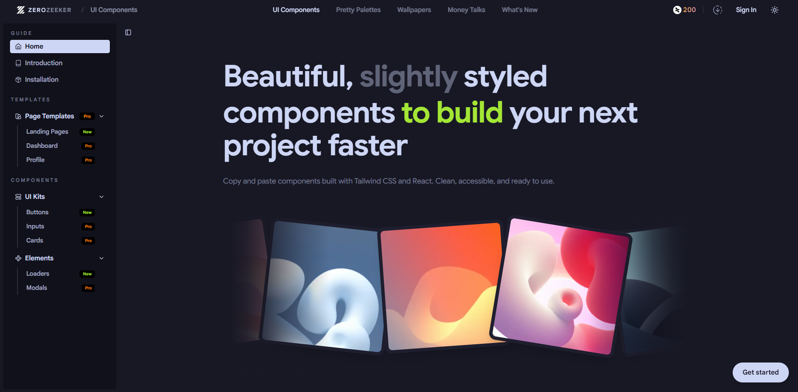

 

 

# **ZERO** ZEEKER

**Modern UI components and a minimal design system for fast, polished interfaces.**

 

**[Try the live site](https://www.zerozeeker.com/)** · [Report a bug](https://github.com/ZERO-DAWN-X/zero-zeeker/issues) · [Request a feature](https://github.com/ZERO-DAWN-X/zero-zeeker/issues)

 

---

## What is Zero Zeeker?

Zero Zeeker is a **UI component library and design system** for developers and teams who want ready-made, accessible components and a consistent visual language. Use the live site to browse components and palettes; add them to your app via CLI or the shadcn-style registry. No lock-in, copy-paste friendly, theme-aware.

---

## What you get

- **Pixel Goodies** – Aesthetic components, typography, and layout building blocks.
- **Pretty Palettes** – Color scale generation, harmony tools, contrast checks, and export-ready snippets.
- **Landing and pricing** – Reference pages and patterns you can reuse.
- **Theme-aware UI** – Light/dark support and a consistent design token system.
- **Modern stack** – Next.js 16, React 19, TypeScript, Tailwind v4, Radix UI.

---

## Try it

1. **Browse:** [zerozeeker.com](https://www.zerozeeker.com/) – see components and palettes in action.
2. **Install:** Use the CLI to list available components and add the ones you need.

| Action | Command |
| --- | --- |
| List components | `npx zerozeeker list` |
| Add a component | `npx zerozeeker add <name>` |

Other install options (registry, shadcn CLI) are in the [installation guide](./INSTALLATION.md).

---

## Design system at a glance

Zero Zeeker uses a small set of tokens and rules so components stay consistent and easy to theme.

| Pillar | Description |
| --- | --- |
| **Color** | Light base and dark base with subtle gradients and neutral surfaces. Full palettes and contrast tools on the site. |
| **Typography** | Bold headings, tight letter-spacing, clear hierarchy. Built for readability and impact. |
| **Surfaces** | Minimal borders, soft glows, and logo-based accents. Enough structure without clutter. |
| **Motion** | Smooth transitions for theme and state. No decorative animation by default. |

---

## Built with

Next.js 16 (App Router), React 19, TypeScript 5, Tailwind CSS 4, Radix UI, React Hook Form, Zod, Lucide React, Anime.js.

---

## Community

- **Bugs and features:** [Open an issue](https://github.com/ZERO-DAWN-X/zero-zeeker/issues).
- **Source code:** Repo and local setup details will be published when the project is fully open. Use the site and the registry in the meantime.

---

## Developer

**Praveen Kavindu** · Plymouth University · Software Engineer · Full-stack and UI/UX

Building clean interfaces and design systems with modern tooling and pixel-perfect detail.

 

 

---

**Zero Zeeker · Fueled by pixels**

Modern UI components and design system. Copy, paste, ship.

